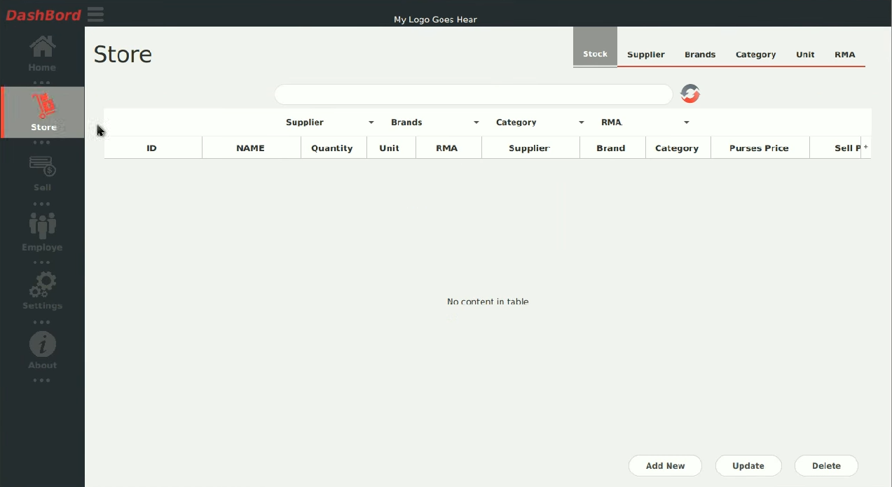

**Shop Keeper – Super Shop Management System**

**Authors:**

_Khondokar Hashibul Islam_

**Built with:**

- JDK 7
- JavaFX
- Oracle SQL

**Requirements**** :**

- Java JDK
- Check if Java is set to the Environment path
- Oracle 11G

**Installation**** :**

- Goto &#39;Salesmanement&#39; folder

- Run &#39;javac SalesManageMent.java&#39; in cmd
- Run &#39;java SalesManageMent&#39; in cmd
- Give your database Username and Password
- Create a new Account
- Login with that Account
- AND!!! HURRAH!!!! You have ran the software! ENJOY!

#

# Slideshow:

#

# Screen Shots:

